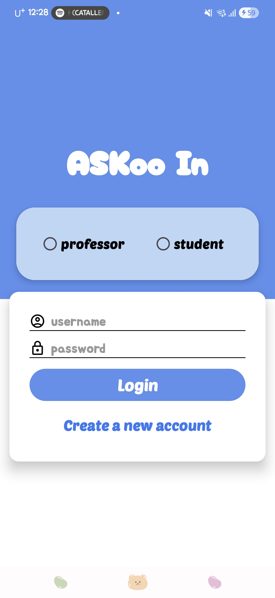
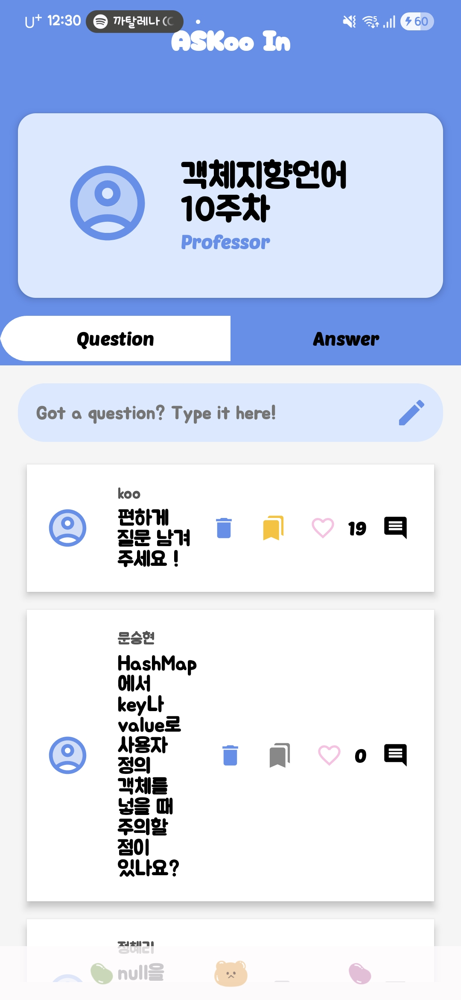
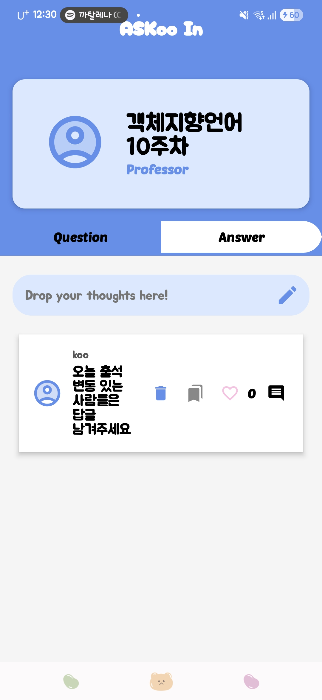

# Askoo In 📱  
_A real-time, anonymous Q&A mobile application_

<p align="center">
  
  
  
</p>

---

## 📖 Project Overview
**Askoo In** is an Android Q&A mobile application created for the  
**Object-Oriented Programming (Java)** course project.  

The main project objective was to design and implement  
a functional app or game — our team developed a  
**real-time Q&A app for classroom environments**.  

The name **Askoo In** combines:  
- **Ask In** → asking questions inside one platform  
- **Prof. Koo** → our professor's name  
- and becomes **Askoo In** ✨  

---

## ❓ Problem Motivation
During class, many students hesitate to speak up due to:  
- shyness  
- fear of judgement  
- lack of confidence  

As a result, valuable interaction and curiosity are often lost.

---

## 💡 Our Solution
Askoo In solves this problem by providing an anonymous communication platform:  

- Students can ask questions **without revealing their identity**  
- Instructors receive questions instantly through **Firebase**  
- The app enables **live discussion, feedback, and interaction**  

---

## 🔐 Key Features
- **Real-time Q&A system** (Firebase Realtime Database)  
- **Anonymous posting** using hashing  
- **AES-based encryption functions** to ensure privacy  
- **Filtering system** to detect inappropriate content  
- **Professor/Student role selection system**  
- **Bookmark, delete, and like functions**  
- **UI optimized for classroom usage**  

---

## 📱 App Screenshots

### 🔵 Login Page
<p align="center">
  
</p>

### 📝 Questions View (Professor Page)
<p align="center">
  
</p>

### 💬 Answers View (Professor Page)
<p align="center">
  
</p>

---

📂 Repository Structure

```
📦 root
├─ archive/ # old version & previous builds
├─ video/ # project demo & final presentation video
├─ document/ # midterm & final project reports
│
├─ AsKoo_In.apk # final application build
├─ 객지프젝발표.pptx # final presentation slides
└─ README.md
```


---


## 🚀 Installation  
Download the APK below:

👉 **AsKoo_In.apk** (latest stable release)

Install on Android and run immediately —  
no configuration required.

---

## 🛠 Development Environment  
- **Language:** Java  
- **Framework:** Android Studio  
- **Database:** Firebase  
- **Target Device:** Android  

---

## 📑 Supporting Materials
- Final project slides included  
- Midterm & final reports inside `/document/` folder  
- Demo & presentation video in `/video/` folder  

---

## 🌈 Results
Askoo In successfully created an environment where  
students can communicate comfortably and  
professors receive real-time classroom feedback.

---

## 🙌 Credits  
Developed by:  
**Yeji Ryu**

Professor:  
**Prof. Koo**

---

## ✨ Demo Video  
Check `/video/` folder to see:  
- real app run demo  
- final presentation video  

---

Thank you for checking out **Askoo In**!  
Feel free to explore the project and try the app 🚀 
